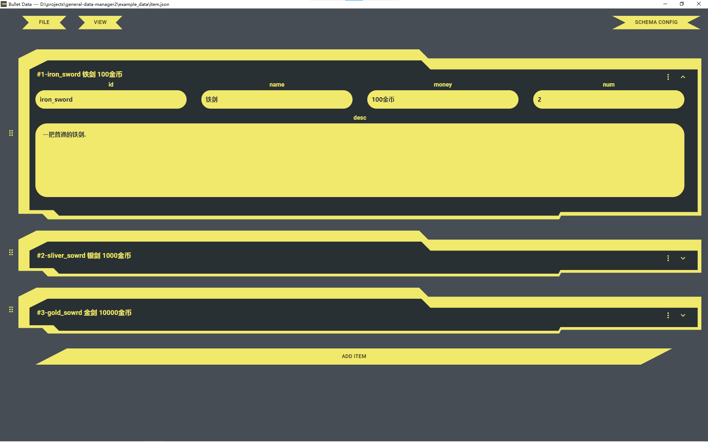

# Bullet Data

  [English](./README.md) | [中文](./docs/README_zh.md)
  
  
Bullet Data is aim to customize visualize configuration data. Support `json` data visualize.
  
Currently only the windows platform is supported.
  
## Screenshots




Example data at `example_data` folder。


## Features
  
- Visualize data config
- convenient to dynamically modify the structure and format the data according to the configuration information
- Support custom validation of fields
- Supports multi-level nesting of fields
- Supports data i18n
  
## How to compile
  
```shell
  npm install
  npm run start
  ```
