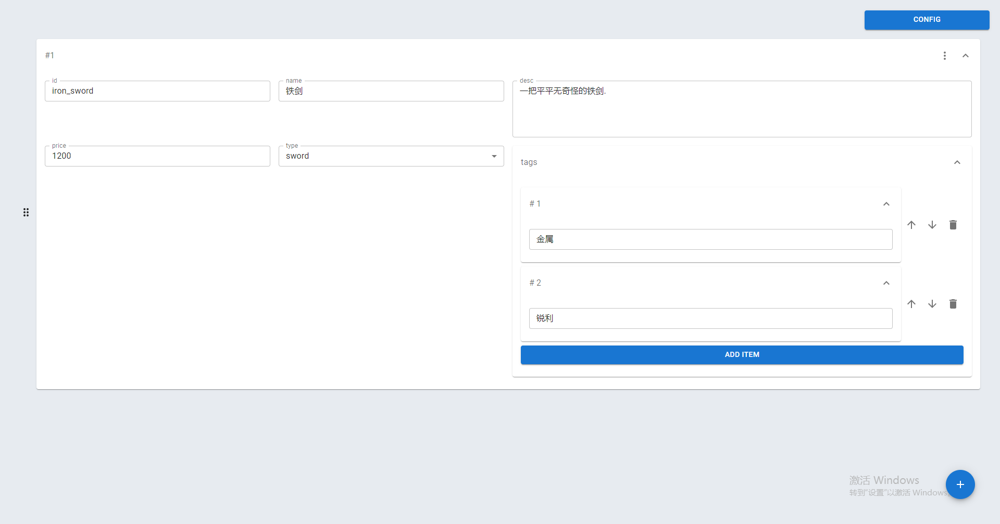
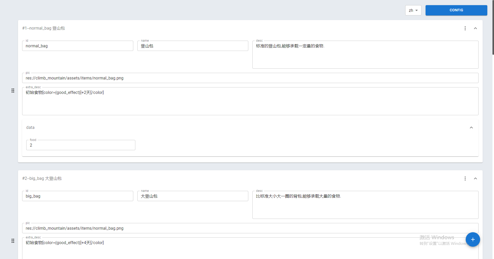
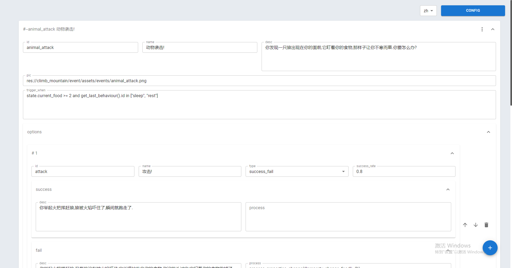

# General Data Manager

```
[English](docs/README_en.md) | [中文](README.md)
```

General Data Manager is aim to customize visualize configuration data.

Currently only the windows platform is supported.

## Example

### Simple Data Config

Config：

```json
{
  "i18n": [],
  "schema": {
    "type": "object",
    "fields": {
      "id": {
        "name": "id",
        "config": {
          "colSpan": 3,
          "defaultValue": "",
          "type": "singleline"
        },
        "type": "string"
      },
      "name": {
        "name": "name",
        "config": {
          "colSpan": 3,
          "defaultValue": "",
          "type": "singleline"
        },
        "type": "string"
      },
      "desc": {
        "name": "desc",
        "config": {
          "colSpan": 6,
          "defaultValue": "",
          "type": "multiline"
        },
        "type": "string"
      },
      "price": {
        "name": "price",
        "config": {
          "colSpan": 3,
          "defaultValue": 0,
          "type": "float"
        },
        "type": "number"
      },
      "type": {
        "name": "type",
        "config": {
          "colSpan": 3,
          "options": [
            {
              "name": "sword",
              "value": "sword"
            },
            {
              "name": "spear",
              "value": "spear"
            }
          ],
          "defaultValue": ""
        },
        "type": "select"
      },
      "tags": {
        "name": "tags",
        "config": {
          "colSpan": 6,
          "initialExpand": true
        },
        "type": "array",
        "fieldSchema": {
          "type": "string",
          "config": {
            "colSpan": 12,
            "defaultValue": "",
            "type": "singleline"
          }
        }
      }
    },
    "config": {
      "colSpan": 12,
      "enableWhen": null,
      "initialExpand": true,
      "summary": "#{{___index}}"
    }
  }
}
```


Screenshot：




Example output：

```json
[
  {
    "id": "iron_sword",
    "name": "铁剑",
    "desc": "一把平平无奇怪的铁剑.",
    "type": "sword",
    "tags": [
      "金属",
      "锐利"
    ],
    "price": 1200
  }
]
```


### Example Item List

Config：

```json
{
  "i18n": [
    "zh",
    "en"
  ],
  "schema": {
    "type": "object",
    "fields": {
      "id": {
        "name": "id",
        "config": {
          "colSpan": 3,
          "defaultValue": "",
          "type": "singleline",
          "needI18n": false
        },
        "type": "string"
      },
      "name": {
        "name": "name",
        "config": {
          "colSpan": 3,
          "defaultValue": "",
          "type": "singleline",
          "needI18n": true
        },
        "type": "string"
      },
      "desc": {
        "name": "desc",
        "config": {
          "colSpan": 6,
          "defaultValue": "",
          "type": "multiline",
          "needI18n": true
        },
        "type": "string"
      },
      "pic": {
        "name": "pic",
        "config": {
          "colSpan": 12,
          "defaultValue": "",
          "type": "singleline",
          "needI18n": false
        },
        "type": "string"
      },
      "extra_desc": {
        "name": "extra_desc",
        "config": {
          "colSpan": 12,
          "defaultValue": "",
          "type": "multiline",
          "needI18n": true
        },
        "type": "string"
      },
      "data": {
        "name": "data",
        "config": {
          "colSpan": 12,
          "initialExpand": true
        },
        "type": "object",
        "fields": {
          "food": {
            "name": "food",
            "config": {
              "colSpan": 3,
              "defaultValue": 0
            },
            "type": "number"
          }
        }
      }
    },
    "config": {
      "colSpan": 12,
      "initialExpand": true,
      "summary": "#{{___index}}--{{id}} {{name}}"
    }
  }
}
```


Screenshot：




Example output：

```json
[
  {
    "id": "normal_bag",
    "name": {
      "zh": "登山包",
      "en": "Bag"
    },
    "desc": {
      "zh": "标准的登山包,能够承载一定量的食物."
    },
    "extra_desc": {
      "zh": "初始食物[color={good_effect}]+2天[/color]"
    },
    "pic": "res://climb_mountain/assets/items/normal_bag.png",
    "data": {
      "food": 2
    }
  },
  {
    "id": "big_bag",
    "name": {
      "zh": "大登山包"
    },
    "desc": {
      "zh": "比标准大小大一圈的背包,能够承载大量的食物."
    },
    "extra_desc": {
      "zh": "初始食物[color={good_effect}]+4天[/color]"
    },
    "pic": "res://climb_mountain/assets/items/normal_bag.png",
    "data": {
      "food": 4
    }
  },
  {
    "id": "heavy_bag",
    "name": {
      "zh": "重型登山包"
    },
    "desc": {
      "zh": "超级大型的背包,能够承载巨量的食物,不过非常累赘"
    },
    "extra_desc": {
      "zh": "初始食物[color={good_effect}]+7天[/color]\\n最大精力[color={bad_effect}]-2[/color]"
    },
    "pic": "res://climb_mountain/assets/items/normal_bag.png",
    "data": {
      "food": 7
    }
  }
]
```


### Example Event List

Config：

```json
{
  "i18n": [
    "zh",
    "en"
  ],
  "schema": {
    "type": "object",
    "fields": {
      "id": {
        "name": "id",
        "config": {
          "colSpan": 3,
          "defaultValue": "",
          "type": "singleline",
          "needI18n": false
        },
        "type": "string"
      },
      "name": {
        "name": "name",
        "config": {
          "colSpan": 3,
          "defaultValue": "",
          "type": "singleline",
          "needI18n": true
        },
        "type": "string"
      },
      "desc": {
        "name": "desc",
        "config": {
          "colSpan": 6,
          "defaultValue": "",
          "type": "multiline",
          "needI18n": true
        },
        "type": "string"
      },
      "pic": {
        "name": "pic",
        "config": {
          "colSpan": 12,
          "defaultValue": "",
          "type": "singleline",
          "needI18n": false
        },
        "type": "string"
      },
      "trigger_when": {
        "name": "trigger_when",
        "config": {
          "colSpan": 12,
          "defaultValue": "",
          "type": "multiline",
          "needI18n": false
        },
        "type": "string"
      },
      "options": {
        "name": "options",
        "config": {
          "colSpan": 12,
          "initialExpand": true
        },
        "type": "array",
        "fieldSchema": {
          "type": "object",
          "fields": {
            "id": {
              "name": "id",
              "config": {
                "colSpan": 3,
                "defaultValue": "",
                "type": "singleline",
                "needI18n": false
              },
              "type": "string"
            },
            "name": {
              "name": "name",
              "config": {
                "colSpan": 3,
                "defaultValue": "",
                "type": "singleline",
                "needI18n": true
              },
              "type": "string"
            },
            "type": {
              "name": "type",
              "config": {
                "colSpan": 3,
                "options": [
                  "plain",
                  "success_fail"
                ],
                "defaultValue": "plain"
              },
              "type": "select"
            },
            "success_rate": {
              "name": "success_rate",
              "config": {
                "colSpan": 3,
                "enableWhen": "(v) => v.type === 'success_fail'",
                "defaultValue": 0
              },
              "type": "number"
            },
            "success": {
              "name": "success",
              "config": {
                "colSpan": 12,
                "initialExpand": true,
                "enableWhen": "(v) => v.type === 'success_fail'"
              },
              "type": "object",
              "fields": {
                "desc": {
                  "name": "desc",
                  "config": {
                    "colSpan": 6,
                    "defaultValue": "",
                    "type": "multiline",
                    "needI18n": true
                  },
                  "type": "string"
                },
                "process": {
                  "name": "process",
                  "config": {
                    "colSpan": 6,
                    "defaultValue": "",
                    "type": "multiline",
                    "needI18n": false
                  },
                  "type": "string"
                }
              }
            },
            "fail": {
              "name": "fail",
              "config": {
                "colSpan": 12,
                "initialExpand": true,
                "enableWhen": "(v) => v.type === 'success_fail'"
              },
              "type": "object",
              "fields": {
                "desc": {
                  "name": "desc",
                  "config": {
                    "colSpan": 6,
                    "defaultValue": "",
                    "type": "multiline",
                    "needI18n": true
                  },
                  "type": "string"
                },
                "process": {
                  "name": "process",
                  "config": {
                    "colSpan": 6,
                    "defaultValue": "",
                    "type": "multiline",
                    "needI18n": false
                  },
                  "type": "string"
                }
              }
            },
            "plain": {
              "name": "plain",
              "config": {
                "colSpan": 12,
                "initialExpand": true,
                "enableWhen": "(v) => v.type === 'plain'"
              },
              "type": "object",
              "fields": {
                "desc": {
                  "name": "desc",
                  "config": {
                    "colSpan": 6,
                    "defaultValue": "",
                    "type": "multiline",
                    "needI18n": true
                  },
                  "type": "string"
                },
                "process": {
                  "name": "process",
                  "config": {
                    "colSpan": 6,
                    "defaultValue": "",
                    "type": "multiline",
                    "needI18n": false
                  },
                  "type": "string"
                }
              }
            }
          },
          "config": {
            "colSpan": 12,
            "initialExpand": false
          }
        }
      }
    },
    "config": {
      "colSpan": 12,
      "enableWhen": null,
      "initialExpand": false,
      "summary": "#{{_index}}--{{id}} {{name}}"
    }
  }
}
```


Screenshot：




Example output：

```json
[
  {
    "id": "animal_attack",
    "name": {
      "zh": "动物袭击!",
      "en": ""
    },
    "options": [
      {
        "id": "attack",
        "type": "success_fail",
        "success_rate": 0.8,
        "success": {
          "desc": {
            "zh": "你举起火把挥赶狼,狼被火焰吓住了,瞬间就跑走了."
          },
          "process": ""
        },
        "fail": {
          "desc": {
            "zh": "你举起火把挥赶狼,但是狼没有被火焰吓住,它凶狠地扑向你的食物,你没能斗过它,它叼着你的食物跑掉了."
          },
          "process": "process_properties_change({\"property_change_food\": -2})"
        },
        "plain": {
          "desc": "",
          "process": ""
        },
        "name": {
          "zh": "攻击!",
          "en": ""
        }
      },
      {
        "id": "stay",
        "type": "success_fail",
        "success_rate": 0.5,
        "success": {
          "desc": {
            "zh": "你对着狼大吼,狼好像被你的声音吓到,瞬间就跑走了."
          },
          "process": ""
        },
        "fail": {
          "desc": {
            "zh": "你对着狼大吼,但是狼突然扑了过来,你没能斗过它,它叼着你的食物跑掉了."
          },
          "process": "process_properties_change({\"property_change_food\": -2})"
        },
        "plain": {
          "desc": "",
          "process": ""
        },
        "name": {
          "zh": "大吼!",
          "en": ""
        }
      },
      {
        "id": "flee",
        "type": "plain",
        "success_rate": 0,
        "success": {
          "desc": "",
          "process": ""
        },
        "fail": {
          "desc": "",
          "process": ""
        },
        "plain": {
          "desc": {
            "zh": "你拿起装备赶紧往山下方向逃跑,跑了一段时间后你甩开了狼."
          },
          "process": "process_properties_change({\"property_change_height\": -500 })"
        },
        "name": {
          "zh": "逃跑!",
          "en": ""
        }
      }
    ],
    "trigger_when": "state.current_food >= 2 and get_last_behaviour().id in [\"sleep\", \"rest\"]",
    "pic": "res://climb_mountain/event/assets/events/animal_attack.png",
    "desc": {
      "zh": "你发现一只狼出现在你的面前,它盯着你的食物,那样子让你不寒而栗.你要怎么办?",
      "en": ""
    }
  },
  {
    "id": "rain",
    "name": {
      "zh": "下雨",
      "en": ""
    },
    "options": [
      {
        "id": "ok",
        "name": {
          "zh": "知道了"
        },
        "type": "plain",
        "success_rate": 0,
        "success": {
          "desc": "",
          "process": ""
        },
        "fail": {
          "desc": "",
          "process": ""
        },
        "plain": {
          "desc": {
            "zh": ""
          },
          "process": "add_buffer(\"rain\", 5)"
        }
      }
    ],
    "trigger_when": "get_last_behaviour().id in [\"sleep\"]",
    "pic": "res://climb_mountain/event/assets/events/rain.png",
    "desc": {
      "zh": "你一觉醒来,发现天突然下起的雨,虽然能够冒雨前行,不过会对后续的行动造成影响.\n[color={property_hint}]接下来会出现[color={bad_effect}]下雨[/color]效果[/color]",
      "en": ""
    }
  },
  {
    "id": "wet",
    "name": {
      "zh": "潮湿"
    },
    "desc": {
      "zh": "在雨中前进,你感觉身上都湿透了.\n[color={property_hint}]获得[color={bad_effect}]潮湿[/color]效果[/color]"
    },
    "pic": "",
    "trigger_when": "state.buffers.has(\"rain\") and get_last_behaviour().type == \"route_walk\"",
    "options": [
      {
        "id": "ok",
        "name": {
          "zh": "好吧"
        },
        "type": "plain",
        "success_rate": 0,
        "success": {
          "desc": "",
          "process": ""
        },
        "fail": {
          "desc": "",
          "process": ""
        },
        "plain": {
          "desc": {
            "zh": "",
            "en": ""
          },
          "process": "remove_buffer(\"rain\");add_buffer(\"wet\", 5)"
        }
      }
    ]
  },
  {
    "id": "unhelath",
    "name": {
      "zh": "身体不适"
    },
    "desc": {
      "zh": "早上起来,你感觉身体状态不妙,估计是因为身上的潮湿,让你得了感冒.\n[color={property_hint}]接下来[color={plain}]前进[/color]消耗[color={plain}]精力[/color][color={bad_effect}]+100%[/color][/color]"
    },
    "pic": "",
    "trigger_when": "state.buffers.has(\"wet\") and get_last_behaviour().id == \"sleep\"",
    "options": [
      {
        "id": "ok",
        "name": {
          "zh": "该死!"
        },
        "type": "plain",
        "success_rate": 0,
        "success": {
          "desc": "",
          "process": ""
        },
        "fail": {
          "desc": "",
          "process": ""
        },
        "plain": {
          "desc": {
            "zh": "",
            "en": ""
          },
          "process": "remove_buffer(\"wet\");add_buffer(\"unhelath\", 1)"
        }
      }
    ]
  }
]
```


## Features

- Visualize configuration data
- convenient to dynamically modify the structure and format the data according to the configuration information
- Support custom validation of fields
- Supports multi-level nesting of fields
- Supports multilingualization of data

## Config Documentation

The configuration items of the fields are configured in `fields`. The key value in `fields` is the key value of the field. The configuration items of the sub-items in the field are as follows:

| field  | feature                                                      | required |
| ------ | ------------------------------------------------------------ | -------- |
| type   | Defines the type of the field, `string`, `object`, `number`, `array`, `select` | yes      |
| config | Segment configuration information for the corresponding type | no       |
| name   | The name of the field displayed on the interface             | no       |


If the field type is `object`, the configuration item needs to add a new configuration item `fields` to describe which fields the corresponding `object` has, for example:

```json
{
    "type": "object",
    "fields": {
        "id": {
            "type": "string",
            "config": {
                "colSpan": 3,
                "type": "singleline"
            }
        },
        "name": {
            "type": "string",
            "config": {
                "colSpan": 3,
                "type": "singleline"
            }
        },
        "desc": {
            "type": "string",
            "config": {
                "colSpan": 6,
                "type": "multiline"
            }
        }
    }
}
```


If the field type is `array`, a configuration item `fieldSchema` needs to be added to describe the data structure of the corresponding `array` sub-item. Example:

```json
{
    "type": "array",
    "fieldSchema": {
        "type": "string",
        "config": {
            "type": "multiline"
        }
    }
}
```


The internationalization configuration needs to add the key of the corresponding language in the topmost i18n array. If the data is empty, the default is no internationalization. Example:

```text
"i18n": ["zh","en"] // Indicates that the two languages zh and en are required
```


### Data Type Configuration

Common configuration for all types:

| field        | feature                                                      | default value                                                |
| ------------ | ------------------------------------------------------------ | ------------------------------------------------------------ |
| colSpan      | The proportion of the width of the data in the card (total width 12) | Type is object, array is 12, string, number is 3             |
| defaultValue | Default value of field                                       | Default value for the field type                             |
| enableWhen   | The data determines whether it exists according to the conditions, js function | None, example: "enableWhen": "(obj) => obj.name === 'good'", where obj is the object where the current field is located |

object:

| field         | feature                                                      | default value                                                |
| ------------- | ------------------------------------------------------------ | ------------------------------------------------------------ |
| summary       | The content of the card title, which supports data formatting, and refers to the property value through {{your_property}} | "{{___key}}", \_\_\_key is a special mark, indicating the current field name |
| initialExpand | Whether to expand data by default                            | true                                                         |


array:

| field         | feature                                                      | default value                                                |
| ------------- | ------------------------------------------------------------ | ------------------------------------------------------------ |
| summary       | The title content of the sub-item card, which can support data formatting, and refer to the property value through {{your_property}} | "{{___index}}", \_\_\_index is a special mark, indicating the serial number of the current child |
| initialExpand | Whether to expand data by default                            | false                                                        |


string:

| field                   | feature                                                      | default value                                                |
| ----------------------- | ------------------------------------------------------------ | ------------------------------------------------------------ |
| type                    | Text type, "singleline" for single-line editing, "multiline" for multi-line editing | "singleline"                                                 |
| required                | Is it necessary                                              | true                                                         |
| customValidate          | Custom validation function, js function                      | None, example: "enableWhen": "(v) => v.includes('test')", where v is the current input value |
| customValidateErrorText | Custom error text when validation fails                      | ""                                                           |
| helperText              | prompt text                                                  | ""                                                           |
| minLen                  | Minimum length of text that can be entered                   | 1                                                            |
| maxLen                  | Maximum length of text that can be entered                   | unlimited                                                    |
| rows                    | The line height of the text box, only takes effect when type=multiline | 4                                                            |
| needI18n                | Whether internationalization is required                     | false                                                        |


number:

| field                   | feature                                                      | default value                                                |
| ----------------------- | ------------------------------------------------------------ | ------------------------------------------------------------ |
| type                    | Numeric type, "int" is an integer, "float" is a floating point number | "float"                                                      |
| required                | Is it necessary                                              | true                                                         |
| customValidate          | Custom validation function, js function                      | None, example: "enableWhen": "(v) => v > 1000", where v is the current input value |
| customValidateErrorText | Custom error text when validation fails                      | ""                                                           |
| helperText              | prompt text                                                  | ""                                                           |
| min                     | The minimum value that can be entered                        | unlimited                                                    |
| max                     | The maximum value that can be entered                        | unlimited                                                    |
| prefix                  | Numerical prefix, only displayed on the interface, does not affect the actual data output | ""                                                           |
| suffix                  | Numerical suffix, only displayed on the interface, does not affect the actual data output | ""                                                           |


select:

| field   | feature                                                      | default value |
| ------- | ------------------------------------------------------------ | ------------- |
| options | List of options, array format [{ "name": "Test", "value": "test"}] | []            |


## How to compile

```shell
npm install
npm run start
```


## Development plan

- [ ] Support image display
- [ ] supports custom filter conditions
- [ ] supports data grouping
- [ ] Support data type inheritance and reference
- [ ] Project-level data management