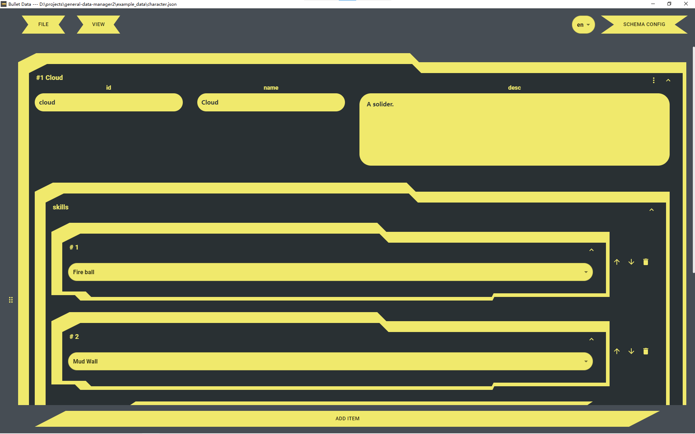

# Bullet Data

[English](../README.md) | [中文](./README_zh.md)

Bullet Data 目的是让配置数据管理可视化，能够根据数据格式自定义定制对应的编辑面板。支持 json 数据的可视化和格式化。

目前只支持 windows 平台。

## 截图




## 功能点

- 可视化配置数据
- 动态修改结构方便，根据配置信息格式化数据
- 支持字段的自定义校验
- 支持字段的多级嵌套
- 支持数据的多语言化


## 配置项文档


字段的配置项在 `fields` 里面开始配置，`fields` 中的 key 值为字段的 key 值，field 中子项的配置项如下：

| 配置项 | 功能                                                         | 是否必填 |
| ------ | ------------------------------------------------------------ | -------- |
| type   | 定义字段的类型，`string`，`object`，`number`、`array`、`select` | 是       |
| config | 对应类型的细分配置信息                                       | 否       |
| name   | 字段在界面上展示的名字                                       | 否       |


如果类型为 `object`，配置项需要新加一个配置项 `fields`，用来描述对应 `object` 拥有哪些字段，示例：

```json
{
    "type": "object",
    "fields": {
        "id": {
            "type": "string",
            "config": {
                "colSpan": 3,
                "type": "singleline"
            }
        },
        "name": {
            "type": "string",
            "config": {
                "colSpan": 3,
                "type": "singleline"
            }
        },
        "desc": {
            "type": "string",
            "config": {
                "colSpan": 6,
                "type": "multiline"
            }
        }
    }
}
```


如果类型为 `array`，配置项需要新加一个配置项 `fieldSchema`，用来描述对应 `array` 子项的数据结构，示例：

```json
{
    "type": "array",
    "fieldSchema": {
        "type": "string",
        "config": {
            "type": "multiline"
        }
    }
}
```


国际化的配置需要在最上层的 i18n 数组中添加对应语言的 key，数据为空默认是没有国际化。示例：

```text
"i18n": ["zh","en"] // 表示需要 zh、en 这两个语言
```


### 数据类型配置信息

所有类型的通用配置：

| 配置项       | 功能                                  | 默认值                                                       |
| ------------ | ------------------------------------- | ------------------------------------------------------------ |
| colSpan      | 该项数据在卡片中的宽度占比(总宽度 12) | 类型为 object、array 是 12，string、number 是 3              |
| defaultValue | 该项数据的默认值                      | 对应类型的默认值                                             |
| enableWhen   | 该项数据根据条件确定是否存在，js 函数 | 无，示例："enableWhen": "(obj) => obj.name === 'good'"，其中 obj 为当前字段所在的对象 |


object:

| 配置项        | 功能                                                         | 默认值                                                 |
| ------------- | ------------------------------------------------------------ | ------------------------------------------------------ |
| summary       | 卡片标题内容，可支持数据格式化，通过 {{your_property}} 来引用属性值 | "{{___key}}"，\_\_\_key 为特殊标记，表示当前的字段名称 |
| initialExpand | 是否默认展开数据                                             | true                                                   |


array:

| 配置项        | 功能                                                         | 默认值                                                       |
| ------------- | ------------------------------------------------------------ | ------------------------------------------------------------ |
| summary       | 子项卡片标题内容，可支持数据格式化，通过 {{your_property}} 来引用属性值 | "{{___index}}"，\_\_\_index 为特殊标记，表示当前子项的序列号 |
| initialExpand | 是否默认展开数据                                             | false                                                        |


string:

| 配置项                  | 功能                                                     | 默认值                                                       |
| ----------------------- | -------------------------------------------------------- | ------------------------------------------------------------ |
| type                    | 文本类型,"singleline" 为单行编辑，"multiline" 为多行编辑, "code" 为代码 | "singleline"                                                 |
| required                | 是否必须                                                 | true                                                         |
| customValidate          | 自定义的校验函数，js 函数                                | 无，示例："enableWhen": "(v) => v.includes('test')"，其中 v 为当前的输入值 |
| customValidateErrorText | 自定义校验失败时的错误提示文本                           | ""                                                           |
| minLen                  | 可输入文本最小长度                                       | 1                                                            |
| maxLen                  | 可输入文本最大长度                                       | 无限                                                         |
| height                  | 文本框的行高，type=multiline 或者 type=code 时才生效       | "200px"                                                      |
| needI18n                | 是否需要国际化,当 type=code 时不生效                                           | false                                                        |
| codeLang                | type="code" 时可用,值为 monca editor 的可选语言 | ""                                                        |


number:

| 配置项                  | 功能                                           | 默认值                                                       |
| ----------------------- | ---------------------------------------------- | ------------------------------------------------------------ |
| type                    | 数值类型,"int" 为整数，"float" 为浮点数        | "float"                                                      |
| required                | 是否必须                                       | true                                                         |
| customValidate          | 自定义的校验函数，js 函数                      | 无，示例："enableWhen": "(v) => v > 1000"，其中 v 为当前的输入值 |
| customValidateErrorText | 自定义校验失败时的错误提示文本                 | ""                                                           |
| min                     | 可输入的最小值                                 | 无限                                                         |
| max                     | 可输入的最小值                                 | 无限                                                         |
| prefix                  | 数值前缀，只会显示在界面上，不影响实际数据输出 | ""                                                           |
| suffix                  | 数值后缀，只会显示在界面上，不影响实际数据输出 | ""                                                           |


select:

| 配置项  | 功能                                                      | 默认值 |
| ------- | --------------------------------------------------------- | ------ |
| options | 选项列表，数组格式为 [{ "label": "Test", "value": "test"}] | []     |


## 如何编译运行

```shell
npm install
npm run start
```
